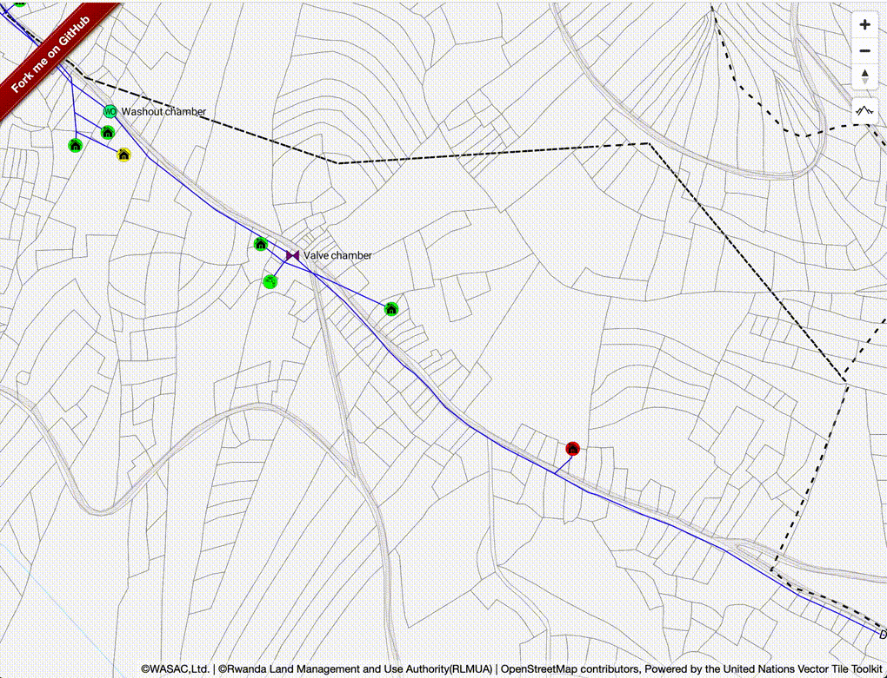

# mapbox-gl-elevation


This module adds elevation control to mapbox-gl.

## Installation:

```bash
npm i @watergis/mapbox-gl-elevation --save
```

## Demo:

See [demo](https://watergis.github.io/mapbox-gl-elevation/#12/-1.08551/35.87063).



## Usage:

```ts
import MapboxElevationControl from "@watergis/mapbox-gl-elevation";
import '@watergis/mapbox-gl-elevation/css/styles.css';
import mapboxgl from 'mapbox-gl';

const map = new mapboxgl.Map();
map.addControl(new MapboxElevationControl(
        'https://wasac.github.io/rw-terrain/tiles/{z}/{x}/{y}.png',
        { 
          font: ['Roboto Medium'],
          fontSize: 12,
          fontHalo: 1,
          mainColor: '#263238',
          haloColor: '#fff',
        }
    ), 'top-right');
});
```

## Development:

```bash
npm run lint # check styling of source code
npm run lint:fix # fix styling by eslint
npm run dev
```

open [http://localhost:8080](http://localhost:8080).

If there are any changes on source code, it will be reflected automatically.

## Build package:

```bash
npm run build
```

The modules will be generated under `dist` folder.

## Deploy to Github pages

```bash
npm run deploy
```

It will deploy files under `example` folder to gh-pages.

## How to release

```zsh
vi package.json
# update version in package.json
git add package.json
git commit -m "v1.X.X"
git push origin master
git tag v1.X.X master
git push --tag
# release CI will create draft release in Github pages, then publish it if it is ready.
# publish CI will deploy npmjs and Github Packages.
```

## Contribution

This Mapbox GL Elevation Control is still under development. so most welcome any feedbacks and pull request to this repository.
